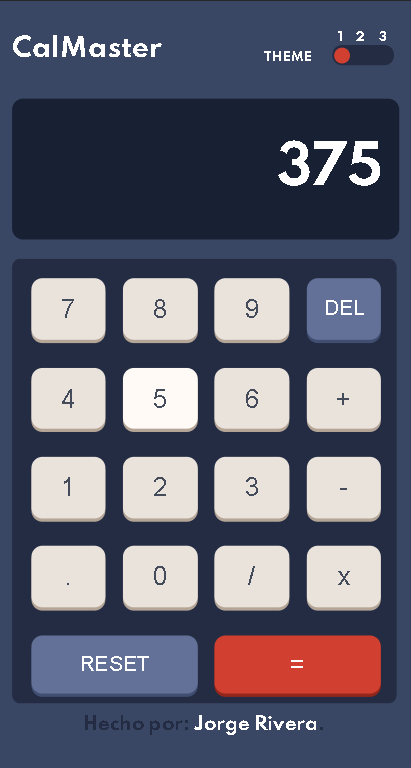
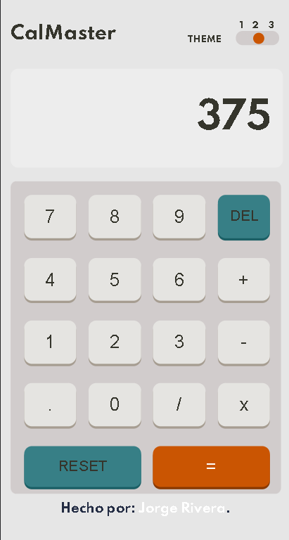
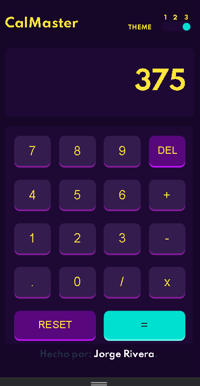

Calculator app solution


## Table of contents

- [Overview](#overview)
  - [The challenge](#the-challenge)
  - [Screenshot](#screenshot)
  - [Links](#links)
- [My process](#my-process)
  - [Built with](#built-with)
  - [What I learned](#what-i-learned)
  - [Continued development](#continued-development)
  - [Useful resources](#useful-resources)
- [Author](#author)


## Overview

### The challenge

Users should be able to:

- See the size of the elements adjust based on their device's screen size
- Perform mathmatical operations like addition, subtraction, multiplication, and division
- Adjust the color theme based on their preference
- **Bonus**: Have their initial theme preference checked using `prefers-color-scheme` and have any additional changes saved in the browser


### Theme-1

### Theme-2

### Theme-3



### Links

- Solution URL: [http://calculadora.jorgerivera.me/]


## My process

### Built with

- Semantic HTML5 markup
- CSS custom properties for first theme
- Flexbox
- CSS Grid responsive
- JS code
- CSS properties for theme 2 and 3


### What I learned

During the development of this project, the most outstanding learning was to create and make use of "Classes" within Js.

Like a "Constructor" within a class, it is nothing more than a special method to create and initialize an object within it.

```js
class Display {
    constructor(displayValue){
        this.displayValue = displayValue;
        this.calculator = new Calculator();
        this.operator = undefined;
        this.value1 = '';
        this.value2 = '';
        this.simbols = {
            add: '+',
            sub: '-',
            divi: '/',
            mult: 'x'
        }
    }
    }
```
In addition, the methods were used to work within the same class:
```js
operation(){
        
            const value1 = parseFloat(this.value1);
            const value2 = parseFloat(this.value2);
            console.log(this.operator);
               
            if( isNaN(value1) ||isNaN(value2)) return
            this.value1 = this.calculator[this.operator](value2, value1);
            console.log(this.value1);
            console.log(this.value2);
            this.operator = undefined;
            this.value2 = '';
            this.printValue();
   
    }
```
In this way it is possible to generate the logic within the same class


### Continued development

I would like to continue focusing on learning more about the "Classes" within JS, as well as its structure, since I found this tool very useful for project development.


### Useful resources

- [resource 1](https://developer.mozilla.org/es/docs/Web/JavaScript/Reference/Classes) - This helped me understand the basic structure of the classes.
- [resource 2](https://www.w3schools.com/howto/howto_css_switch.asp) - This helped me design a toggle as a selector.


## Author

- Website - [Jorge Rivera](https://www.jorgerivera.me)


